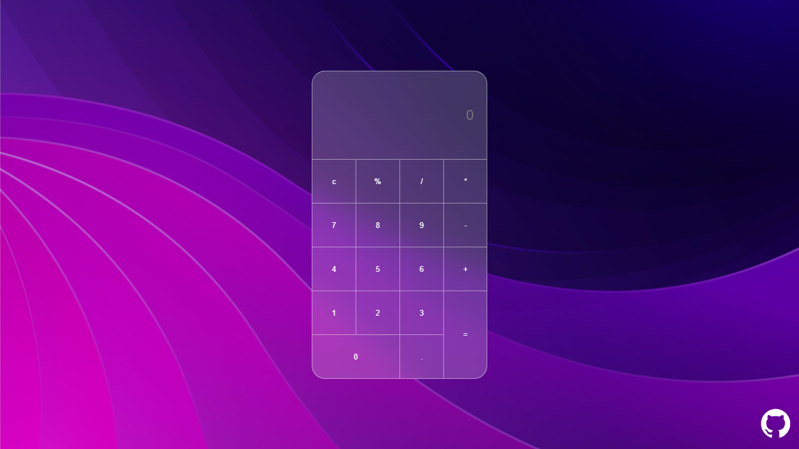

# Calculadora Glassmorphism

## Introdução

Calculadora simples criada com HTML, CSS e Javascript

## Techs utilizadas
* HTML: para estruturação da página;
* CSS: para estilização;
* JavaScript: para manipulação dos dados;
* [Tilt.js](https://micku7zu.github.io/vanilla-tilt.js/): biblioteca javascript que cria animação 3d.